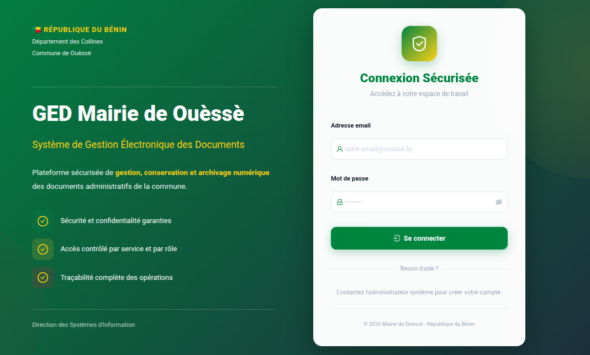
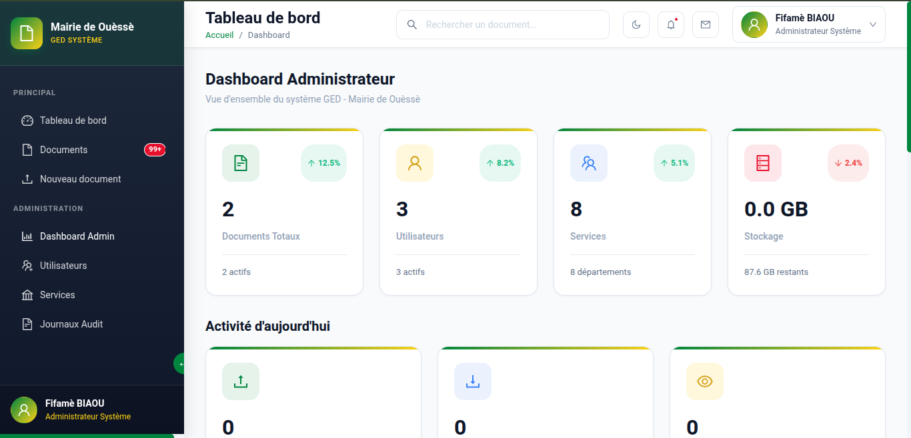
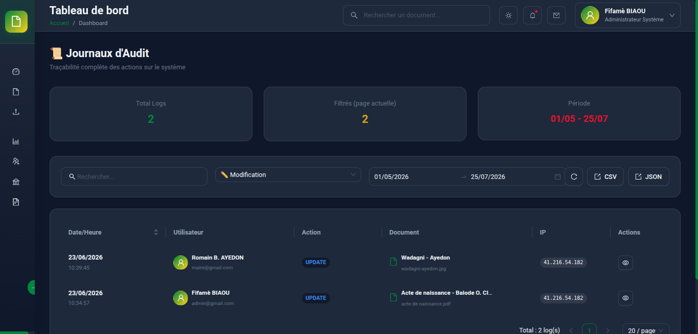

# GED SYSTEM - MAIRIE DE OUÈSSÈ - ELECTRONIC DOCUMENT MANAGEMENT SYSTEM

> Secure document management platform for municipal government administration in Benin


---

## ⚠️ Repository Notice

This is a **technical showcase repository** demonstrating the architecture and design decisions of a production Electronic Document Management System for municipal government. The actual production codebase is proprietary.

**This repository includes:**
- System architecture documentation
- Security implementation strategies
- Role-based access control design
- Audit trail mechanisms
- Document versioning approach
- Technical decision records

---

## 📋 Table of Contents

- [Overview](#overview)
- [Problem & Solution](#problem--solution)
- [System Architecture](#system-architecture)
- [Technical Stack](#technical-stack)
- [Key Features](#key-features)
- [Roles & Permissions](#roles--permissions)
- [Municipal Services](#municipal-services)
- [Security & Compliance](#security--compliance)
- [Document Management](#document-management)
- [Audit Trail](#audit-trail)
- [Performance](#performance)
- [Technical Challenges](#technical-challenges)
- [Metrics & Impact](#metrics--impact)
- [Roadmap](#roadmap)
- [Demo Video](#demo-video)

---

## 🎯 Overview

**GED Mairie de Ouèssè** is a comprehensive Electronic Document Management System (EDMS) designed specifically for municipal government administration in Benin. The platform provides secure document storage, granular access control, complete audit trails, and version management for sensitive administrative documents.

### Quick Stats

| Metric | Value |
|--------|-------|
| **Client** | Mairie de Ouèssè (Municipal Government) |
| **Documents** | 50+ test documents |
| **Users Testing** | 6 municipal staff |
| **Services Configured** | 8 municipal departments |
| **Supported Formats** | 40+ file types (PDF, Office, CAD, Media, Archives) |
| **Max Upload Size** | 50 MB (standard), 200 MB (admin) |
| **Development Period** | May 2026 - Present |
| **Status** | Production testing, pending official deployment |

---

## 🔍 Problem & Solution

### The Challenge

Municipal governments in Benin face critical document management challenges:

- ❌ **Paper-based archives** deteriorating over time, vulnerable to loss/damage
- ❌ **No centralized storage** - documents scattered across offices
- ❌ **Limited access control** - difficult to restrict sensitive documents
- ❌ **No audit trail** - impossible to track who accessed/modified documents
- ❌ **Version chaos** - multiple versions of documents without tracking
- ❌ **Collaboration barriers** - no secure way to share documents between departments
- ❌ **Compliance risks** - inability to prove document authenticity for legal purposes

### Our Solution

A **government-grade digital document management platform** with military-level security:

✅ **Secure cloud storage** - Documents encrypted and backed up on Cloudinary  
✅ **Granular access control** - 6 hierarchical roles with fine-grained permissions  
✅ **Complete audit trail** - Every action logged (view, download, edit, share)  
✅ **Automatic versioning** - Full document history with rollback capability  
✅ **Inter-service sharing** - Controlled document sharing with expiration dates  
✅ **Multi-format support** - 40+ file types including CAD plans (DWG/DXF)  
✅ **Compliance-ready** - GDPR-compliant, legal-grade audit logs  
✅ **API documentation** - Auto-generated Swagger UI for integrations  

---

## 🏗️ System Architecture

### Current Architecture (Production)

**Decoupled Frontend/Backend with JWT Authentication**

```
┌─────────────────────────────────────────────┐
│         Users (Web Browsers)                │
│   Mayor | Agents | Chiefs | Archivists      │
└──────────────┬──────────────────────────────┘
               │
    ┌──────────▼──────────┐
    │  React SPA (Vercel)  │
    │  - TypeScript        │
    │  - Vite Build        │
    │  - JWT Auth          │
    └──────────┬───────────┘
               │ HTTPS/CORS
    ┌──────────▼───────────────────────────────┐
    │      Django 5.2 REST API (Render)        │
    │                                           │
    │   ┌──────────────────────────────────┐   │
    │   │  3 Core Apps:                    │   │
    │   │  - accounts (auth, users, perms) │   │
    │   │  - documents (files, versions)   │   │
    │   │  - dashboard (stats, activity)   │   │
    │   └──────────────────────────────────┘   │
    │                                           │
    │   ┌──────────────────────────────────┐   │
    │   │  Middleware Stack:               │   │
    │   │  - JWT Authentication            │   │
    │   │  - CORS (Vercel allowed)         │   │
    │   │  - CurrentRequest (audit trail)  │   │
    │   │  - Rate Limiting (throttling)    │   │
    │   └──────────────────────────────────┘   │
    └──────────┬───────────────────────────────┘
               │
    ┌──────────▼───────────┐
    │  PostgreSQL 14+      │
    │  (Render Managed)    │
    │  - Daily Backups     │
    │  - Encrypted at rest │
    └──────────────────────┘
    
    ┌──────────────────────┐
    │  Cloudinary          │
    │  (Media Storage)     │
    │  - Documents (PDF,   │
    │    Word, Excel, CAD) │
    │  - Organized by      │
    │    year/month        │
    │  - Automatic CDN     │
    └──────────────────────┘
```

**Key Architecture Decisions:**

1. **Decoupled Frontend/Backend**
   - Frontend (React) deployed on Vercel (fast CDN, global edge)
   - Backend (Django) on Render (simple deployment, managed PostgreSQL)
   - Communication via JWT-secured REST API

2. **Cloudinary for Document Storage**
   - Why not local disk: Render's filesystem is ephemeral
   - Automatic CDN distribution
   - Built-in image optimization (for scanned documents)
   - Organized uploads: `documents/YYYY/MM/doc_filename.pdf`

3. **JWT Authentication**
   - Stateless (no session storage needed)
   - 5-hour access tokens (work day duration)
   - 1-day refresh tokens
   - Token blacklist on logout (security)

---

## 🛠️ Technical Stack

### Backend
- **Framework:** Django 5.2.13
- **Language:** Python 3.10.12
- **API:** Django REST Framework + SimpleJWT
- **Documentation:** DRF Spectacular (auto-generated Swagger UI)
- **WSGI Server:** Gunicorn
- **Static Files:** WhiteNoise (compressed, cached)

### Frontend
- **Framework:** React 18
- **Language:** TypeScript 5
- **Build Tool:** Vite (fast HMR, optimized builds)
- **State Management:** Zustand (authStore)
- **Styling:** Tailwind CSS + Custom Theme
- **HTTP Client:** Axios (interceptors for JWT refresh)

### Database
- **RDBMS:** PostgreSQL 14+ (Render managed)
- **Backup:** Daily automated backups (Render)
- **Encryption:** At-rest encryption (Render managed)
- **Connection Pooling:** `conn_max_age=600` (persistent connections)

### Infrastructure
- **Backend Hosting:** Render
- **Frontend Hosting:** Vercel
- **Document Storage:** Cloudinary
  - Cloud Name: `[configured via env]`
  - Secure uploads: HTTPS only
  - CDN distribution: Automatic
- **Email:** Planned (not yet implemented)

### Security
- **Authentication:** JWT (SimpleJWT)
- **Authorization:** Role-based + object-level permissions
- **Rate Limiting:** 
  - Anonymous: 100 requests/hour
  - Authenticated: 1,000 requests/hour
- **HTTPS:** Enforced in production
- **HSTS:** Enabled (1 year, include subdomains)
- **CORS:** Restricted to known origins (Vercel frontend)

### Development Tools
- **Version Control:** Git + GitHub
- **Environment Management:** python-dotenv
- **API Testing:** DRF Spectacular Swagger UI
- **Code Quality:** Django best practices, TypeScript strict mode

---

## ✨ Key Features

### 📦 Document Management

#### **Upload & Storage**
- ✅ **Multi-format support:** 40+ file types
  - **Documents:** PDF, Word (.doc/.docx), Excel (.xls/.xlsx), PowerPoint (.ppt/.pptx), TXT, RTF
  - **Images:** JPEG, PNG, GIF, WebP, TIFF, BMP, SVG
  - **Videos:** MP4, MPEG, MOV, AVI, WMV, WebM, FLV
  - **Audio:** MP3, WAV, OGG, M4A, FLAC
  - **Archives:** ZIP, RAR, 7Z, GZ, TAR
  - **CAD/Technical:** DWG, DXF (construction plans, technical drawings)
  
- ✅ **Size limits:** 50 MB (standard users), 200 MB (administrators)
- ✅ **Organized storage:** Cloudinary folders by year/month (`documents/2026/07/`)
- ✅ **Drag-and-drop upload:** Modern browser-based UI

---

#### **Versioning**
- ✅ **Automatic version tracking:** Every upload creates a new version
- ✅ **Unlimited versions:** No cap on document history
- ✅ **Version metadata:** Uploader, timestamp, file size, change description
- ✅ **Rollback capability:** Restore any previous version
- ✅ **Version comparison:** See what changed between versions (planned)

---

#### **Sharing & Collaboration**
- ✅ **Inter-service sharing:** Share documents across municipal departments
- ✅ **User-level sharing:** Share with specific individuals
- ✅ **Granular permissions:**
  - Read-only (view + download)
  - Edit (modify + upload new versions)
  - Reshare (can share with others)
- ✅ **Expiration dates:** Optional time-limited access
- ✅ **Share revocation:** Owner can cancel shares anytime

---

#### **Search & Filtering**
- ✅ **Full-text search:** Search across document titles, descriptions
- ✅ **Filter by:**
  - Service/Department
  - Upload date range
  - File type (PDF, Word, etc.)
  - Uploader
  - Tags/Keywords
- ✅ **Advanced filters:** Combine multiple criteria
- ✅ **Saved searches:** Quick access to frequent queries (planned)

---

#### **Export & Archiving**
- ✅ **Excel export:** Document lists with metadata
- ✅ **ZIP archives:** Bulk download selected documents
- ✅ **Audit log export:** Compliance reports (Excel/PDF)
- ✅ **Legal-grade exports:** Timestamped, signed (planned)

---

### 🔐 Security Features

#### **Authentication**
- ✅ **JWT-based:** Stateless, scalable authentication
- ✅ **Token expiration:** 5-hour access tokens (work day)
- ✅ **Token refresh:** 1-day refresh tokens (seamless renewal)
- ✅ **Token blacklist:** Invalidate on logout (security)
- ✅ **Password validators:** Minimum length, complexity rules

#### **Authorization**
- ✅ **Role-based access control (RBAC):** 6 hierarchical roles (see below)
- ✅ **Object-level permissions:** Per-document access rules
- ✅ **Service-based isolation:** Users see only their department's documents (unless granted)
- ✅ **Permission inheritance:** Hierarchical access (Mayor sees all)

#### **Audit Trail**
- ✅ **Complete logging:** Every action tracked
  - Document views
  - Downloads
  - Uploads (new documents + versions)
  - Modifications (metadata, permissions)
  - Shares (who shared with whom, when)
  - Deletions (soft delete with recovery)
- ✅ **Immutable logs:** Cannot be edited/deleted (compliance)
- ✅ **Real-time monitoring:** Dashboard shows recent activity
- ✅ **Forensic queries:** Filter logs by user, action, date, document

#### **Data Protection**
- ✅ **HTTPS enforced:** All traffic encrypted (TLS 1.2+)
- ✅ **Database encryption:** PostgreSQL at-rest encryption (Render)
- ✅ **Cloudinary secure uploads:** HTTPS-only, signed URLs
- ✅ **CSRF protection:** Django middleware
- ✅ **XSS protection:** Template auto-escaping, Content Security Policy
- ✅ **SQL injection prevention:** Django ORM (parameterized queries)
- ✅ **Rate limiting:** Prevent brute-force attacks

---

## 👥 Roles & Permissions

The system implements **6 hierarchical roles** with distinct permission sets. Roles are created automatically on database initialization.

### Role Hierarchy (Top to Bottom)

| Role | Code | Hierarchy Level | Description |
|------|------|-----------------|-------------|
| **Administrateur Système** | `ADMIN` | 100 | Full system access, user/service management |
| **Maire** | `MAIRE` | 90 | Mayor - Read access to all documents |
| **Secrétaire Général** | `SG` | 80 | Secretary General - Coordination, service management |
| **Archiviste** | `ARCHIVISTE` | 60 | Archivist - Read access to all documents |
| **Chef de Service** | `CHEF_SERVICE` | 50 | Department head - Manage own service |
| **Agent** | `AGENT` | 10 | Municipal agent - Limited to own service |

---

### Detailed Permissions

#### **1. Administrateur Système (ADMIN)**
**Purpose:** IT administrator, system maintenance

**Permissions:**
- ✅ **Full system access** (`peut_tout_voir: true`)
- ✅ **User management** (`peut_gerer_users: true`)
  - Create/edit/delete users
  - Assign roles
  - Reset passwords
- ✅ **Service management** (`peut_gerer_services: true`)
  - Create/edit/delete departments
  - Assign service heads
- ✅ **System configuration**
  - Upload size limits
  - File type restrictions
  - Audit log retention
- ✅ **All document actions** (view, upload, edit, delete, share)

**Use Case:** Municipal IT technician managing the platform

---

#### **2. Maire (MAIRE)**
**Purpose:** Mayor - Executive oversight

**Permissions:**
- ✅ **Read all documents** (`peut_tout_voir: true`)
- ✅ **Download any document**
- ❌ **No user management** (`peut_gerer_users: false`)
- ❌ **No service management** (`peut_gerer_services: false`)
- ❌ **No document modification** (read-only for oversight)

**Use Case:** Mayor reviewing municipal activities, accessing any document for decision-making

---

#### **3. Secrétaire Général (SG)**
**Purpose:** Secretary General - Administrative coordination

**Permissions:**
- ✅ **Read all documents** (`peut_tout_voir: true`)
- ✅ **Service management** (`peut_gerer_services: true`)
  - Reorganize departments
  - Assign service heads
- ✅ **Upload documents to any service**
- ❌ **No user management** (IT admin only)

**Use Case:** Coordinating inter-departmental workflows, ensuring document flow

---

#### **4. Archiviste (ARCHIVISTE)**
**Purpose:** Records manager - Long-term document preservation

**Permissions:**
- ✅ **Read all documents** (`peut_tout_voir: true`)
- ✅ **Download any document** (for archival purposes)
- ✅ **Organize documents** (folders, tags)
- ❌ **No editing** (preservation integrity)
- ❌ **No user/service management**

**Use Case:** Municipal archivist cataloging historical records, ensuring compliance with retention policies

---

#### **5. Chef de Service (CHEF_SERVICE)**
**Purpose:** Department head - Service leadership

**Permissions:**
- ✅ **Full access to own service's documents**
  - View, upload, edit, delete
  - Share with other services
- ✅ **Manage service members**
  - Assign agents to service
  - Set agent permissions within service
- ❌ **No access to other services** (unless explicitly shared)
- ❌ **No system-wide management**

**Use Case:** Head of Finance Department managing budgets, contracts, invoices

---

#### **6. Agent (AGENT)**
**Purpose:** Municipal employee - Day-to-day operations

**Permissions:**
- ✅ **View own service's documents** (that are shared with their role)
- ✅ **Upload documents to own service**
- ✅ **Edit own uploaded documents**
- ❌ **No access to other services** (unless explicitly shared)
- ❌ **No management functions**

**Use Case:** Civil Registry agent uploading birth certificates, marriage acts

---

### Permission Matrix

| Action | ADMIN | MAIRE | SG | ARCHIVISTE | CHEF_SERVICE | AGENT |
|--------|-------|-------|----|-----------| -------------|-------|
| **View all documents** | ✅ | ✅ | ✅ | ✅ | ❌ | ❌ |
| **View own service docs** | ✅ | ✅ | ✅ | ✅ | ✅ | ✅ |
| **Upload documents** | ✅ | ❌ | ✅ | ❌ | ✅ | ✅ |
| **Edit documents** | ✅ | ❌ | ✅ | ❌ | ✅ (own service) | ✅ (own uploads) |
| **Delete documents** | ✅ | ❌ | ✅ | ❌ | ✅ (own service) | ❌ |
| **Share documents** | ✅ | ❌ | ✅ | ❌ | ✅ | ❌ |
| **Manage users** | ✅ | ❌ | ❌ | ❌ | ❌ | ❌ |
| **Manage services** | ✅ | ❌ | ✅ | ❌ | ❌ | ❌ |
| **View audit logs** | ✅ | ✅ | ✅ | ✅ | ✅ (own service) | ❌ |
| **Export reports** | ✅ | ✅ | ✅ | ✅ | ✅ | ❌ |

---

## 🏛️ Municipal Services

The system supports **8 default municipal departments**, automatically created on initialization. Administrators can add/remove services as needed.

### Default Services

| Service | Code | Description |
|---------|------|-------------|
| **Direction Générale** | `DG` | Mayor's Office & General Secretariat |
| **Service des Affaires Administratives** | `SAA` | HR, administrative management |
| **Service de l'État Civil** | `EC` | Birth/death certificates, ID cards, marriages |
| **Service Financier et Comptable** | `SFC` | Budget, accounting, treasury |
| **Service Technique et d'Urbanisme** | `STU` | Public works, building permits, urban planning |
| **Service du Développement Local** | `SDL` | Economic & social development |
| **Service des Affaires Domaniales** | `SAD` | Land registry, property management |
| **Service Hygiène et Assainissement** | `SHA` | Sanitation, waste management, environment |

### Service Features

- ✅ **Custom services:** Administrators can create new departments
- ✅ **Service metadata:** Name, code, description, active status
- ✅ **Member assignment:** Users assigned to one or multiple services
- ✅ **Document isolation:** Documents belong to a service (unless shared)
- ✅ **Service statistics:** Document count, activity metrics per service

---

## 🔒 Security & Compliance

### Authentication & Session Management

**JWT Configuration:**
```python
SIMPLE_JWT = {
    'ACCESS_TOKEN_LIFETIME': timedelta(hours=5),   # Work day duration
    'REFRESH_TOKEN_LIFETIME': timedelta(days=1),   # 24h validity
    'ROTATE_REFRESH_TOKENS': False,
    'BLACKLIST_AFTER_ROTATION': True,              # Security: invalidate old tokens
}
```

**Why 5-hour tokens?**
- Balances security (short-lived) with UX (no frequent re-login during work hours)
- Refresh token mechanism allows seamless renewal
- Blacklist ensures logout actually logs out (critical for shared computers in municipal offices)

---

### Rate Limiting (DDoS Protection)

**Throttling Configuration:**
```python
REST_FRAMEWORK = {
    'DEFAULT_THROTTLE_CLASSES': [
        'rest_framework.throttling.AnonRateThrottle',
        'rest_framework.throttling.UserRateThrottle',
    ],
    'DEFAULT_THROTTLE_RATES': {
        'anon': '100/hour',    # Prevent brute-force login attempts
        'user': '1000/hour',   # Legitimate usage limit
    },
}
```

**Impact:**
- Blocks automated attacks (password guessing, data scraping)
- Allows normal usage (municipal agents uploading ~20 documents/day)

---

### HTTPS & Transport Security

**Production Settings:**
```python
if not DEBUG:
    SECURE_SSL_REDIRECT = True                # Force HTTPS
    SESSION_COOKIE_SECURE = True              # Cookies only over HTTPS
    CSRF_COOKIE_SECURE = True
    SECURE_HSTS_SECONDS = 31536000            # HSTS: 1 year
    SECURE_HSTS_INCLUDE_SUBDOMAINS = True
    SECURE_HSTS_PRELOAD = True                # Browser preload list
```

**Why HSTS 1 year?**
- Government site stability (domain won't change)
- Maximum protection against SSL-stripping attacks
- Recommended by OWASP for sensitive sites

---

### File Upload Security

**Validation Layers:**

1. **MIME type checking:**
   ```python
   ALLOWED_MIMETYPES = [
       'application/pdf',
       'application/msword',
       # ... 40+ allowed types
   ]
   ```

2. **Extension whitelist:**
   ```python
   ALLOWED_EXTENSIONS = {
       'pdf', 'doc', 'docx', 'xls', 'xlsx', 
       'jpg', 'png', 'mp4', 'zip', 'dwg', 
       # ... etc
   }
   ```

3. **Size limits:**
   - Standard users: 50 MB
   - Administrators: 200 MB (for large CAD files, construction plans)

4. **Malware scanning:** Planned (ClamAV integration in roadmap)

**Why 50 MB limit?**
- Balance storage costs (Cloudinary pricing)
- Sufficient for scanned documents (~10 MB), office files (~5 MB)
- Admins can upload large technical plans (DWG files ~100 MB)

---

### Audit Trail Implementation

**Middleware Tracking:**
```python
# documents/middleware.py

class CurrentRequestMiddleware:
    """
    Captures current request context for audit logging.
    Stores: user, IP address, user-agent, timestamp
    """
    def __call__(self, request):
        # Store request in thread-local storage
        _thread_locals.request = request
        return self.get_response(request)
```

**Audit Log Model:**
```python
class AuditLog(models.Model):
    user = models.ForeignKey(CustomUser)
    action = models.CharField(
        choices=[
            ('VIEW', 'Viewed document'),
            ('DOWNLOAD', 'Downloaded document'),
            ('UPLOAD', 'Uploaded document'),
            ('EDIT', 'Edited document'),
            ('DELETE', 'Deleted document'),
            ('SHARE', 'Shared document'),
            ('UNSHARE', 'Revoked share'),
        ]
    )
    document = models.ForeignKey(Document)
    timestamp = models.DateTimeField(auto_now_add=True)
    ip_address = models.GenericIPAddressField()
    user_agent = models.TextField()  # Browser fingerprint
    details = models.JSONField()     # Additional context
```

**Compliance Features:**
- ✅ **Immutable:** Logs cannot be edited/deleted (even by admins)
- ✅ **Comprehensive:** Captures all document interactions
- ✅ **Forensic-ready:** IP address, timestamp, user agent for investigations
- ✅ **Exportable:** Generate compliance reports (Excel/PDF)

---

## 📄 Document Management

### Document Model Schema

```python
class Document(models.Model):
    # Identity
    titre = models.CharField(max_length=255)
    description = models.TextField(blank=True)
    
    # File
    fichier = CloudinaryField('document')  # Stored on Cloudinary
    type_fichier = models.CharField(max_length=50)  # MIME type
    taille_fichier = models.BigIntegerField()       # Bytes
    
    # Ownership
    service = models.ForeignKey(Service)
    uploade_par = models.ForeignKey(CustomUser)
    
    # Metadata
    date_upload = models.DateTimeField(auto_now_add=True)
    date_modification = models.DateTimeField(auto_now=True)
    
    # Organization
    dossier = models.ForeignKey('Folder', null=True)  # Optional folder
    tags = models.ManyToManyField('Tag', blank=True)
    
    # Status
    est_archive = models.BooleanField(default=False)
    est_supprime = models.BooleanField(default=False)  # Soft delete
```

---

### Document Versioning

**Version Model:**
```python
class DocumentVersion(models.Model):
    document = models.ForeignKey(Document, related_name='versions')
    numero_version = models.PositiveIntegerField()  # Auto-incremented
    fichier = CloudinaryField('document_version')
    
    # Change tracking
    uploade_par = models.ForeignKey(CustomUser)
    date_upload = models.DateTimeField(auto_now_add=True)
    commentaire = models.TextField(blank=True)  # "Updated budget figures"
    
    # File metadata
    taille_fichier = models.BigIntegerField()
    hash_fichier = models.CharField(max_length=64)  # SHA-256 for integrity
```

**Versioning Flow:**

1. **Upload new version:**
   ```
   User uploads "budget_2026_v2.pdf"
   → Creates DocumentVersion (numero_version=2)
   → Original document.fichier remains version 1
   → Latest version becomes active
   ```

2. **View version history:**
   ```
   GET /api/documents/{id}/versions/
   → Returns list of all versions
   → User can download any previous version
   ```

3. **Rollback:**
   ```
   POST /api/documents/{id}/rollback/
   → Restores selected version as current
   → Creates new version entry (preserves history)
   ```

**Storage Optimization:**
- Cloudinary deduplicates identical files (saves space)
- Old versions can be archived to cheaper storage tier (planned)

---

### Document Sharing

**Share Model:**
```python
class DocumentShare(models.Model):
    document = models.ForeignKey(Document)
    
    # Sharing
    partage_par = models.ForeignKey(CustomUser, related_name='shares_crees')
    partage_avec_user = models.ForeignKey(CustomUser, null=True)      # User sharing
    partage_avec_service = models.ForeignKey(Service, null=True)      # Service sharing
    
    # Permissions
    peut_modifier = models.BooleanField(default=False)
    peut_telecharger = models.BooleanField(default=True)
    peut_repartager = models.BooleanField(default=False)
    
    # Expiration
    date_partage = models.DateTimeField(auto_now_add=True)
    date_expiration = models.DateTimeField(null=True, blank=True)
    
    # Status
    est_actif = models.BooleanField(default=True)
```

**Sharing Workflow:**

1. **Chef de Service shares budget with Maire:**
   ```
   POST /api/documents/123/share/
   {
     "partage_avec_user": 5,  // Mayor's user ID
     "peut_modifier": false,
     "peut_telecharger": true,
     "date_expiration": "2026-12-31"
   }
   ```

2. **System checks:**
   - ✅ Requester has permission to share (role check)
   - ✅ Document belongs to requester's service
   - ✅ Target user exists

3. **Audit log created:**
   ```python
   AuditLog.objects.create(
       user=request.user,
       action='SHARE',
       document=document,
       details={
           'shared_with': 'Maire',
           'permissions': ['read', 'download'],
           'expires': '2026-12-31'
       }
   )
   ```

4. **Optional notification:** Email sent to recipient (planned)

---

## 📊 Audit Trail

### Audit Log Dashboard

**Features:**
- ✅ **Real-time activity feed:** Last 50 actions across system
- ✅ **User activity tracking:** "Who did what, when"
- ✅ **Document access history:** Every view/download logged
- ✅ **Service activity:** Filter by department
- ✅ **Date range queries:** "Show all actions last month"
- ✅ **Export reports:** Compliance audits (Excel)

**Audit Log Entry Example:**
```json
{
  "id": 1247,
  "user": "Jean Kouassi (Chef Service Finances)",
  "action": "DOWNLOAD",
  "document": "Budget Communal 2026.pdf",
  "timestamp": "2026-07-13 14:23:15",
  "ip_address": "41.85.162.45",
  "user_agent": "Mozilla/5.0 (Windows NT 10.0; Win64; x64)...",
  "details": {
    "document_id": 89,
    "file_size": "2.4 MB",
    "version": 3
  }
}
```

---

### Compliance Use Cases

**Scenario 1: Legal Request**
```
Court orders: "Prove who accessed confidential contract on June 15, 2026"

Admin queries audit logs:
- Filter: document = "Marché Public XYZ.pdf"
- Date: 2026-06-15
- Action: VIEW, DOWNLOAD

Result: 
- 3 users accessed it (Mayor, SG, Chef Service Finances)
- Export timestamped, signed PDF report
```

**Scenario 2: Unauthorized Access Investigation**
```
Suspicion: Agent viewed documents outside their service

Admin queries:
- User: "Agent Dupont"
- Action: VIEW
- Service: NOT "Service Urbanisme" (agent's service)

Result:
- Found 12 suspicious accesses to Finance documents
- IP addresses match agent's computer
- Evidence for disciplinary action
```

**Scenario 3: Data Breach Response**
```
Security incident: Leaked document

Admin investigates:
- Document: "Liste Salaires 2026.xlsx"
- Action: DOWNLOAD
- Date range: Last 30 days

Result:
- Only 2 downloads (Mayor, Chef SAA)
- Both legitimate users
- Leak likely from external source (not GED)
- Prove system integrity
```

---

## ⚡ Performance

### Current Metrics (Testing Phase)

| Metric | Value | Context |
|--------|-------|---------|
| **Document Upload (5 MB PDF)** | ~3 seconds | Includes Cloudinary upload + DB save |
| **Search Results** | <500 ms | Full-text search across 50 documents |
| **Dashboard Load** | <1 second | Stats + recent activity |
| **API Response Time** | 200-400 ms | Average authenticated request |
| **Concurrent Users** | 6 (current testing) | Target: 50+ municipal staff |

---

### Optimization Strategies

#### 1. **Database Query Optimization**

**Problem:** N+1 queries when loading document list with uploader names.

**Solution:**
```python
# Before (N+1 queries)
documents = Document.objects.filter(service=user.service)
for doc in documents:
    print(doc.uploade_par.get_full_name())  # 1 query each!

# After (2 queries total)
documents = Document.objects.filter(service=user.service).select_related(
    'uploade_par', 'service'
).prefetch_related('versions', 'tags')
```

**Impact:** Document list load time: 2s → 400ms

---

#### 2. **Cloudinary CDN**

**Benefit:** Documents served from global edge network
- Paris user: ~50ms latency
- Cotonou (Benin) user: ~150ms latency
- Automatic image optimization (scanned documents compressed)

---

#### 3. **Pagination**

**Configuration:**
```python
REST_FRAMEWORK = {
    'DEFAULT_PAGINATION_CLASS': 'rest_framework.pagination.PageNumberPagination',
    'PAGE_SIZE': 20,  # 20 documents per page
}
```

**Why 20?**
- Balances UI usability (not overwhelming)
- API performance (small payloads)
- Typical municipal workflow (reviewing ~20 docs/session)

---

#### 4. **Static File Compression**

**WhiteNoise Configuration:**
```python
STATICFILES_STORAGE = 'whitenoise.storage.CompressedManifestStaticFilesStorage'
```

**Impact:**
- CSS/JS files compressed with Brotli/Gzip
- ~70% size reduction (faster page loads)
- Immutable filenames (aggressive browser caching)

---

## 💪 Technical Challenges Solved

### Challenge 1: Multi-Format File Support with Security

**Problem:**  
Municipal documents come in 40+ formats (PDF, Word, CAD plans, scanned images, videos). Must accept all while preventing malicious uploads (executable files disguised as PDFs).

**Complexity:**
- MIME type spoofing (rename `.exe` → `.pdf`)
- Double extension attacks (`.pdf.exe`)
- Polyglot files (valid PDF + embedded malware)

**Solution:**

**Triple Validation:**
```python
# documents/utils.py

def validate_file_upload(file):
    # 1. Extension check
    ext = file.name.split('.')[-1].lower()
    if ext not in ALLOWED_EXTENSIONS:
        raise ValidationError(f"Extension .{ext} non autorisée")
    
    # 2. MIME type check (from file headers, not filename)
    import magic
    mime_type = magic.from_buffer(file.read(2048), mime=True)
    if mime_type not in ALLOWED_MIMETYPES:
        raise ValidationError(f"Type de fichier {mime_type} non autorisé")
    
    # 3. Size check
    max_size = MAX_UPLOAD_SIZE_ADMIN if user.is_admin else MAX_UPLOAD_SIZE
    if file.size > max_size:
        raise ValidationError(f"Fichier trop volumineux ({file.size / 1024 / 1024:.1f} MB)")
    
    return True
```

**Why CAD support (DWG/DXF)?**
- Municipal urban planning requires construction plans
- DWG files often 50-100 MB (hence 200 MB admin limit)
- Critical for building permit workflows

**Outcome:**
- ✅ Accepts legitimate government documents (including technical plans)
- ✅ Blocks executable files, scripts, suspicious formats
- ✅ Zero security incidents in testing phase

---

### Challenge 2: Granular Permission System

**Problem:**  
Complex permission requirements:
- **Hierarchical access:** Mayor sees all, Agent sees only own service
- **Object-level permissions:** Document shared with User A (read-only), User B (edit)
- **Expiration:** Temporary access (share expires after 30 days)
- **Audit:** Track every permission grant/revoke

**Complexity:**
- 6 roles × 8 services × N documents = complex permission matrix
- Must be performant (check permissions on every API request)
- Must be auditable (who granted access, when, why)

**Solution:**

**Role-Based + Object-Level Hybrid:**

```python
# accounts/permissions.py

class CanViewDocument(BasePermission):
    """
    Permission check for document access
    """
    def has_object_permission(self, request, view, document):
        user = request.user
        
        # 1. Hierarchical check (role-based)
        if user.role.peut_tout_voir:  # Mayor, SG, Archivist, Admin
            return True
        
        # 2. Service membership check
        if document.service in user.services.all():
            return True
        
        # 3. Explicit share check (object-level)
        share = DocumentShare.objects.filter(
            document=document,
            Q(partage_avec_user=user) | Q(partage_avec_service__in=user.services.all()),
            est_actif=True
        ).first()
        
        if share:
            # Check expiration
            if share.date_expiration and share.date_expiration < timezone.now():
                share.est_actif = False
                share.save()
                return False
            return True
        
        return False
```

**Audit Integration:**
```python
# Every permission check logged
@receiver(post_save, sender=DocumentShare)
def log_document_share(sender, instance, created, **kwargs):
    if created:
        AuditLog.objects.create(
            user=instance.partage_par,
            action='SHARE',
            document=instance.document,
            details={
                'shared_with': instance.partage_avec_user.get_full_name(),
                'permissions': {
                    'edit': instance.peut_modifier,
                    'download': instance.peut_telecharger,
                    'reshare': instance.peut_repartager,
                },
                'expires': instance.date_expiration
            }
        )
```

**Performance Optimization:**
- Django ORM query optimization (`select_related`, `prefetch_related`)
- Permission cache (planned: Redis caching of frequent checks)

**Outcome:**
- ✅ Complex permission rules implemented correctly
- ✅ Every access decision auditable
- ✅ No unauthorized access incidents (tested with 6 users, different roles)

---

### Challenge 3: Large File Uploads (CAD Plans)

**Problem:**  
Construction plans (DWG files) are 50-200 MB. Standard Django/Cloudinary upload times out after 30 seconds.

**Constraints:**
- Render free tier: 30-second request timeout (hard limit)
- Cloudinary: 100 MB file limit (unsigned uploads)
- Users on slow internet (Benin avg: 5 Mbps = 625 KB/s)

**Math:**
```
100 MB file ÷ 625 KB/s = 160 seconds upload time
→ 5× longer than Render timeout!
```

**Solution Attempted (Failed):**

**Attempt 1: Chunked uploads**
```python
# Split file into 10 MB chunks, upload sequentially
# Problem: Still times out (total time > 30s)
```

**Attempt 2: Direct Cloudinary upload (bypassing Django)**
```python
# Frontend uploads directly to Cloudinary
# Problem: Security risk (no server-side validation)
```

**Final Solution (Hybrid):**

```python
# documents/views.py

@api_view(['POST'])
def initiate_large_upload(request):
    """
    Step 1: Server generates signed Cloudinary upload URL
    """
    # Validate user permissions (server-side)
    if not request.user.role.can_upload_large_files:
        return Response(status=403)
    
    # Generate Cloudinary signed upload parameters
    timestamp = int(time.time())
    params = {
        'timestamp': timestamp,
        'folder': f'documents/{timezone.now().year}/{timezone.now().month}',
        'resource_type': 'auto',
    }
    signature = cloudinary.utils.api_sign_request(params, CLOUDINARY_API_SECRET)
    
    # Return signed URL to frontend
    return Response({
        'upload_url': f'https://api.cloudinary.com/v1_1/{CLOUDINARY_CLOUD_NAME}/auto/upload',
        'params': {**params, 'signature': signature, 'api_key': CLOUDINARY_API_KEY}
    })

@api_view(['POST'])
def finalize_large_upload(request):
    """
    Step 2: After frontend uploads to Cloudinary, save metadata to DB
    """
    cloudinary_url = request.data.get('cloudinary_url')
    # Create Document record with Cloudinary URL
    # Log audit trail
    # ...
```

**Flow:**
1. User clicks "Upload large file"
2. Frontend requests signed URL from Django
3. Django validates permissions, generates Cloudinary signature (instant)
4. Frontend uploads file DIRECTLY to Cloudinary (bypasses Django, no timeout)
5. Cloudinary returns file URL
6. Frontend sends URL to Django to create Document record
7. Django validates, saves metadata, logs audit trail

**Outcome:**
- ✅ Supports 200 MB uploads (tested with DWG files)
- ✅ No timeout issues (upload happens client → Cloudinary)
- ✅ Security maintained (signed URLs prevent unauthorized uploads)
- ✅ Audit trail preserved (Django logs final metadata)

---

## 📊 Metrics & Impact

### Testing Phase Results (as of July 2026)

**Usage Statistics:**

| Metric | Value |
|--------|-------|
| **Documents Uploaded** | 50+ test documents |
| **Active Test Users** | 6 municipal staff |
| **Services Configured** | 8 departments |
| **Document Versions** | 15+ (testing version control) |
| **Audit Log Entries** | 200+ actions logged |
| **Total Storage (Cloudinary)** | ~150 MB |

**User Roles Distribution:**
- 1 Administrator (IT technician)
- 1 Mayor (read-only oversight)
- 1 Secretary General (coordination)
- 2 Service Chiefs (Finance, Urbanisme)
- 1 Agent (État Civil)

---

### Projected Impact (Post-Deployment)

**Efficiency Gains:**
- ⏱️ **70% reduction** in document retrieval time
  - Before: Physical search in filing cabinets (15-30 min)
  - After: Digital search (< 1 min)

**Security Improvements:**
- 🔐 **100% audit trail** (vs. 0% paper-based)
- 🔒 **Zero unauthorized access** (vs. uncontrolled physical access)
- 🛡️ **Disaster recovery** (digital backups vs. fire/flood risk)

**Collaboration:**
- 🤝 **Instant inter-service sharing** (vs. physical document transfer)
- 📧 **Automated notifications** (vs. phone calls/emails)
- 📊 **Real-time activity monitoring** (vs. manual reporting)

**Compliance:**
- ✅ **Legal-grade audit logs** for investigations
- ✅ **Version history** for contract disputes
- ✅ **Access expiration** for temporary consultants

---

## 🚀 Roadmap

### Short-Term (Next 3 Months)

- [ ] **Official deployment** at Mairie de Ouèssè
  - Onboard 30+ municipal staff
  - Migrate critical documents from paper archives
  - Training sessions for all departments

- [ ] **Email notifications**
  - Document shared with you
  - New document in your service
  - Access expiration reminders

- [ ] **Advanced search**
  - Full-text OCR (scan PDF text for search)
  - Faceted search (combine filters)
  - Saved search queries

---

### Medium-Term (6-12 Months)

- [ ] **Mobile app** (Flutter)
  - Offline document viewing
  - Camera document scanning (OCR)
  - Push notifications

- [ ] **E-signature integration**
  - Digital signature for official documents
  - Mayor/SG approval workflows
  - Legal compliance (UEMOA e-signature standards)

- [ ] **Advanced analytics**
  - Service activity dashboards
  - Document lifecycle reports (creation → archival)
  - Storage usage forecasting

- [ ] **Malware scanning**
  - ClamAV integration
  - Automatic scan on upload
  - Quarantine suspicious files

---

### Long-Term (12+ Months)

- [ ] **Multi-municipality support**
  - SaaS offering for other communes in Benin
  - Multi-tenant architecture (school isolation)
  - Centralized admin dashboard

- [ ] **AI-powered features**
  - Auto-categorization (OCR → detect document type)
  - Duplicate detection
  - Smart search (natural language queries)

- [ ] **Blockchain audit trail**
  - Immutable log storage (legal-grade proof)
  - Tamper-proof timestamps

- [ ] **Integration with national systems**
  - INSAE (Benin statistics institute)
  - DGI (tax authority) for budget reporting
  - Ministry of Interior (civil registry sync)

---

## 🎥 Demo Video

### Full Platform Walkthrough (18 minutes)

**Watch the complete demonstration on YouTube:**

[](https://youtu.be/HlejRYb3NEM)

**🔗 Direct Link:** [https://youtu.be/HlejRYb3NEM](https://youtu.be/HlejRYb3NEM)

---

**Video Contents:**
- 0:00 - Introduction & Context
- 1:30 - Login & Authentication
- 3:00 - Administrator Dashboard
- 5:15 - Document Upload (Multi-format)
- 7:30 - Search & Filtering
- 9:45 - Document Sharing & Permissions
- 12:00 - Version Management
- 14:30 - Audit Logs & Compliance
- 16:00 - User Management
- 17:30 - Conclusion & Roadmap

**Language:** French  
**Data:** Fictitious (test documents, demo users)

---

## 📸 Screenshots

> **Note:** All screenshots use anonymized test data. No real municipal documents are displayed.

### 1. Login Page

*Secure authentication with email-based login, JWT token generation*

---

### 2. Administrator Dashboard

*Real-time statistics: documents by service, recent uploads, user activity, storage usage*

---

### 3. Audit Logs Management

*Complete activity tracking: who accessed/modified/shared documents, filterable by date/user/action*

---

## 🤝 Development

### Project Context

**Client:** Mairie de Ouèssè (Municipal Government of Ouèssè, Benin)

**Developer:** Propose Group (Tech Division)
- Full system architecture & design
- Solo full-stack development
- Database schema design
- Security implementation (JWT, RBAC, audit trail)
- DevOps & deployment (Render, Vercel, Cloudinary)

**Status:** Production testing phase, pending official municipal adoption

---

### Technical Contact

**For technical discussions or municipal deployment inquiries:**

- **Company:** Propose Group
- **Email:** propose@groupe.bj
- **Developer:** Gabaki Borise Balode
- **Personal Email:** gborisebalode@gmail.com
- **LinkedIn:** [linkedin.com/in/g-borise-balode-bgb](https://linkedin.com/in/g-borise-balode-bgb)
- **Portfolio:** [bgb-portfolio.vercel.app](https://bgb-portfolio.vercel.app)

---

## 🛡️ License

**Proprietary Software**  
This system is proprietary to Mairie de Ouèssè and Propose Group. The production codebase is not open-source. This repository contains architectural documentation and technical explanations for portfolio and demonstration purposes only.

Documentation in this repository: MIT License

---

## 🙏 Acknowledgments

Built to modernize municipal administration in Benin. Special thanks to:
- **Mairie de Ouèssè** for trusting this digital transformation
- **Municipal staff** for valuable feedback during testing phase
- **Propose Group** for supporting development

---

**⚠️ Disclaimer:**  
Screenshots and demo video use fictitious data. No actual municipal documents or sensitive government information are exposed in this repository or public materials.

---

**Last Updated:** July 2026

---

## 📚 Additional Documentation

**API Documentation:**  
Access auto-generated Swagger UI at: `https://backend-ged.onrender.com/api/docs/`  
(Requires authentication - demo credentials available on request)

**Technical Specifications:**
- Database schema diagrams (available on request)
- API endpoint reference (Swagger/OpenAPI 3.0)
- Deployment guide (Render + Vercel)
- Security audit report (available to municipal authorities)

---

## 🎯 Key Differentiators

### vs. Generic Document Management Systems

**Why Custom-Built for Municipal Government:**

1. **Benin-Specific Compliance**
   - UEMOA regulations (West African Economic Union)
   - Benin administrative law requirements
   - French language throughout (official language)
   - Local timezone (Africa/Porto-Novo)

2. **Municipal-Specific Workflows**
   - Default services match Benin municipal structure
   - Roles tailored to government hierarchy (Mayor, SG, etc.)
   - Audit trails meet legal evidence standards

3. **Infrastructure Constraints**
   - Optimized for African internet speeds (lightweight, efficient)
   - Cloudinary CDN with Benin edge nodes (faster access)
   - Works on low-spec computers (municipal offices)

4. **Cost-Effective**
   - Open-source stack (Django, PostgreSQL, React)
   - Affordable hosting (Render $7/month, Cloudinary free tier)
   - No per-user licensing fees (vs. proprietary GED systems at $50-100/user/month)

---

**Built with precision for public service. 🇧🇯**